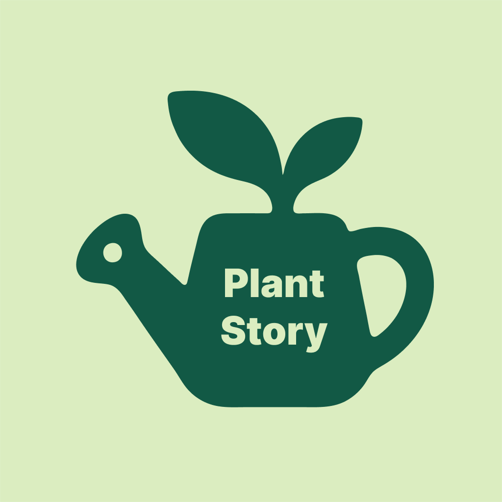

# PlantStory

<p align="center">
  
</p>

<p align="center">
  A vibrant, local-first iOS journal for the plants you raise and the plants you meet outside.
</p>

PlantStory helps you remember the life of each plant—not just its care schedule. Keep a photo timeline, record everyday care, plan seasonal tasks, and save wild discoveries in a private collection that stays on your iPhone.

## Features

### My Garden

- Add and edit plants with a name, alternate name, species, acquisition date, notes, and photos.
- See how many days you have raised each plant.
- Build a chronological life timeline with dated photos, notes, and optional event tags for repotting, pruning, fertilizing, blooming, new growth, pests, treatment, coming home, death, or a custom event. Untagged photos remain “A new moment.”
- Mark a plant’s death from its timeline to give its garden card a muted “In memory” treatment while preserving its days-raised count.
- Automatically use a photo's creation date when that metadata is available.
- Record watering and fertilizing events, review recent history, and remove accidental entries.
- Choose the best fertilizing and pruning months for each plant.
- View seasonal care tasks in a garden calendar.
- Assign plants to locations such as rooms, balconies, or gardens, reuse existing location choices, and browse the home collection grouped by location.
- Search your collection and sort it by name, acquisition date, last watered, or last fertilized in ascending or descending order.

### Wild Finds

- Save plants discovered in parks, on trails, and while traveling.
- Record names, species, discovery dates, notes, and photo timelines.
- Search your saved discoveries.
- Keep wild observations separate from the plants you care for at home.

### Optional AI suggestions

- Bring your own OpenAI API key to suggest plant species, alternate names, care notes, and seasonal care months.
- Generate species and short botanical descriptions for Wild Finds.
- Review every suggestion before applying it.
- AI is completely optional; all core plant-tracking features work without it.
- The API key is stored in the iOS Keychain and requests are billed directly to the user's OpenAI API account.

### Privacy and storage

- No PlantStory account is required.
- No cloud database or PlantStory server is used.
- Plants, photos, notes, and care histories remain inside the app's private local container.
- Plant data is stored in `Library/Application Support/PlantStory/plants.json`.
- Wild Finds are stored in `Library/Application Support/PlantStory/wild-finds.json`.
- Photos and their dates and notes are encoded in those private files.
- Export a versioned JSON backup from **Settings → Storage & Data** and restore it on another iPhone. The backup includes both collections and their photos but excludes the OpenAI API key and StoreKit purchase history.
- When AI is requested, limited text is sent directly to OpenAI; photos and care history are not sent.

Deleting PlantStory deletes its local data from that iPhone. Before deleting it, export a manual backup or transfer the device with Apple Quick Start, iCloud Backup, or a Finder/Apple Devices backup. The OpenAI API key may need to be entered again.

## Manual backup and restore

Open **Settings → Storage & Data** to manage portable backups.

### Create a backup

1. Tap **Export Backup**.
2. Save the generated JSON file to Files, iCloud Drive, or another location you control.
3. Keep the file until you have confirmed the data is available on the destination device.

The backup contains My Garden, Wild Finds, photos, notes, timeline events, locations, and care histories. Because photos are embedded in the JSON file, backups with many photos can be large. OpenAI API keys and StoreKit purchase history are not included.

### Restore a backup

1. Tap **Restore from Backup** and select a PlantStory JSON backup.
2. Review the backup date and the number of plants and Wild Finds shown in the confirmation.
3. Confirm **Restore**.

Restore replaces the current My Garden and Wild Finds collections; it does not merge them. Export the current collection first if you may need it later.

## Download and install

PlantStory is not currently distributed through the App Store or TestFlight. For now, download the source code and build it with Xcode.

[Download the latest source code as a ZIP](https://github.com/zicodeng/PlantStory/archive/refs/heads/main.zip), or clone the repository using the instructions below. An App Store or TestFlight link can be added here when a public build becomes available.

### Requirements

- macOS with Xcode
- iOS 17.0 or later, or an iOS Simulator
- An Apple ID added to Xcode when installing on a physical iPhone
- An OpenAI API key only if you choose to enable AI suggestions

### Build from source

```bash
git clone https://github.com/zicodeng/PlantStory.git
cd PlantStory
open PlantStory.xcodeproj
```

In Xcode:

1. Select the **PlantStory** target.
2. Open **Signing & Capabilities** and choose your development team.
3. If Xcode reports that the bundle identifier is unavailable, replace `com.zicodeng.PlantStory` with a unique identifier such as `com.yourname.PlantStory`.
4. Choose an iOS Simulator or your paired iPhone as the run destination.
5. Press **Run** (`⌘R`).

Installing with a free Apple ID is suitable for personal development but may require periodic reinstalling. App Store or TestFlight distribution requires Apple Developer Program membership.

## AI setup

AI suggestions are disabled by default.

1. Create an API key in your OpenAI account.
2. In PlantStory, open **Settings → AI Suggestions**.
3. Enter the key, acknowledge that requests use your API credits, and save it.
4. Open a plant or Wild Find editor and tap **Suggest with AI**.

PlantStory currently uses `gpt-5.4-nano` through the OpenAI Responses API with response storage disabled. Model availability and API pricing can change; consult OpenAI's current documentation before relying on a particular cost.

## Contributing

Ideas, bug reports, design improvements, and code contributions are welcome.

1. [Open an issue](https://github.com/zicodeng/PlantStory/issues/new) to describe a bug or propose an improvement.
2. Fork the repository.
3. Create a focused branch:

   ```bash
   git checkout -b feature/your-idea
   ```

4. Make your changes and verify that the app builds and runs on an iOS 17+ Simulator.
5. Commit with a clear message and push your branch.
6. Open a pull request explaining what changed and, for UI changes, include before-and-after screenshots.

Please keep pull requests focused, preserve the local-first privacy model, and never commit API keys, signing credentials, or personal data.

## Support the project

If PlantStory is useful to you, [star the project on GitHub](https://github.com/zicodeng/PlantStory) to help other plant lovers discover it.

PlantStory also includes optional StoreKit tips for people who would like to help the garden grow. Tip products require configuration in App Store Connect for a distributed build; the included StoreKit configuration supports local development and testing.

## Credits

PlantStory is vibe-coded with love by [Zico](https://github.com/zicodeng). The complete source is available to explore, customize, and grow into your own plant companion.

## License

A software license has not been added yet. Until one is included, copyright law reserves reuse and redistribution rights to the project owner. If the goal is unrestricted open-source collaboration, adding a standard license such as MIT is recommended.
